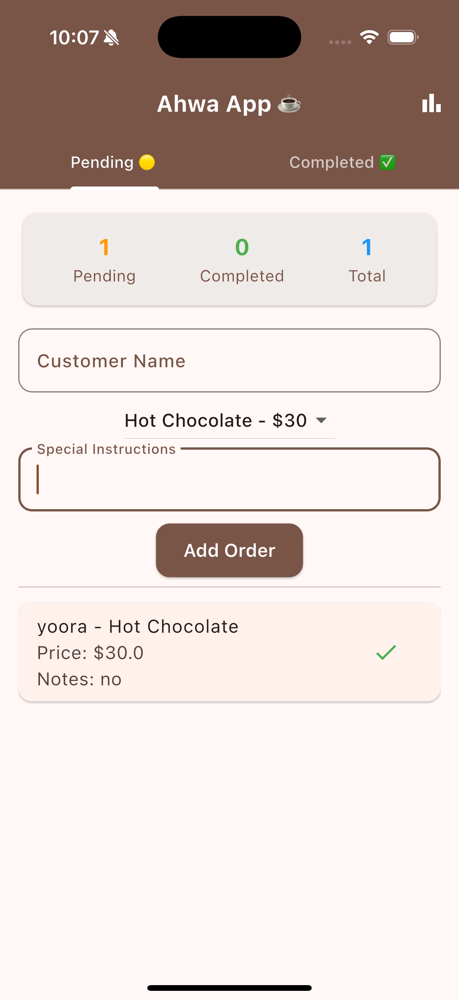
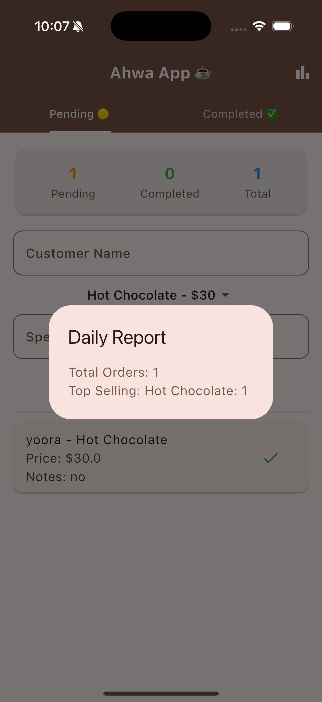

# ☕ Smart Ahwa Manager

A Flutter app for managing customer drink orders in a traditional Cairo *Ahwa* (coffee shop).  
This project demonstrates **OOP concepts** and **SOLID principles** in a clean and practical way.  

---

## 🎯 Project Idea

The goal of this project is to **streamline coffee shop operations**:

- Add and track customer orders
- Mark them as completed
- Generate daily reports for insights (e.g., top-selling drinks)

It also applied :

- Clean code structure
- OOP principles (Encapsulation, Inheritance, Polymorphism, Abstraction)
- SOLID design principles  

---


flowchart TD
    subgraph UI[☕ UI Layer - order_view.dart]
        A1[User enters name & selects drink]
        A2[Clicks "Add Order"]
        A3[Pending & Completed Orders list updates]
        A4[Daily Report button clicked]
    end

    subgraph Services[⚙️ Services Layer]
        B1[OrderService - manages orders]
        B2[ReportService - generates reports]
    end

    subgraph Models[📦 Models Layer]
        C1[Drink (abstract)]
        C2[Coffee, Tea, HotChocolate...]
        C3[Order]
    end

    %% Connections
    A1 --> A2 --> B1
    B1 --> C3
    C3 --> C1
    C1 --> C2
    B1 --> A3
    A4 --> B2
    B2 --> C3
    B2 --> A4

 ---

## 📸 Screenshots

### 🏠 Home Screen  



### 📊 Daily Report  



---

📂 Project Structure

lib/
 ├── models/
 │   ├── drink.dart
 │   └── order.dart
 ├── services/
 │   ├── order_service.dart
 │   └── report_service.dart
 ├── pages/
 │   └── order_view.dart
 └── main.dart

## 📌 Features

- ➕ Add new orders with:
  - Customer name  
  - Drink type (Coffee, Green Tea, Hibiscus Tea, etc.)  
  - Special instructions  
- ✅ Mark orders as **completed**  
- 📊 Dashboard showing **pending, completed, and total orders**  
- 📝 Generate a **daily report** with:
  - Total number of orders  
  - Top-selling drinks  

---

## 🏗 Architecture & Flow

The app follows a simple **MVC-like separation**:

UI (OrderPage)
↓
OrderService (manages orders)
↓
ReportService (generates reports)
↓
Models (Drink, Order)

---

## 🔑 SOLID Principles Applied

- **S – Single Responsibility Principle (SRP):**  
  - `OrderService` only manages orders  
  - `ReportService` only generates reports  

- **O – Open/Closed Principle (OCP):**  
  - Add new drinks (e.g., `TurkishCoffee`) without modifying existing code  

- **L – Liskov Substitution Principle (LSP):**  
  - Any subclass of `Drink` (Coffee, Tea, etc.) can replace another safely  

- **I – Interface Segregation Principle (ISP):**  
  - Code split into small, focused classes instead of "fat interfaces"  

- **D – Dependency Inversion Principle (DIP):**  
  - Services depend on **abstractions** (`Drink` is abstract) instead of concrete classes  

---

## 🛠 Object-Oriented Concepts Used

- **Encapsulation** → `_isCompleted` is private and exposed via getter/setter  
- **Inheritance** → `Drink` is extended by `Coffee`, `GreenTea`, `HibiscusTea`  
- **Polymorphism** → All drinks behave the same but hold different values (name/price)  
- **Abstraction** → `Drink` is abstract, forcing subclasses to define drink details  

---

## 🚀 Getting Started

Clone the repo and run the project:

```bash
git clone https://github.com/Riyam224/smart-ahwa-manager.git
cd smart-ahwa-manager
flutter pub get
flutter run


⸻

