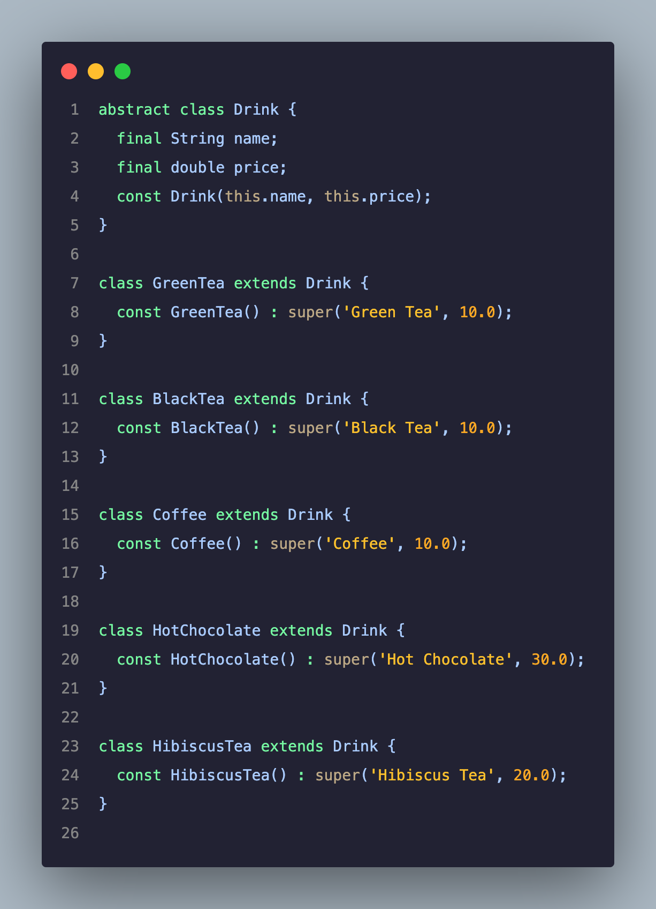
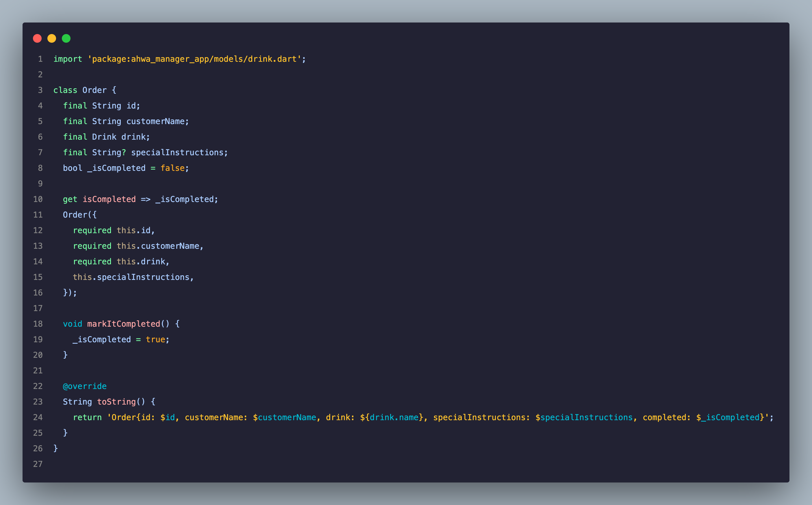
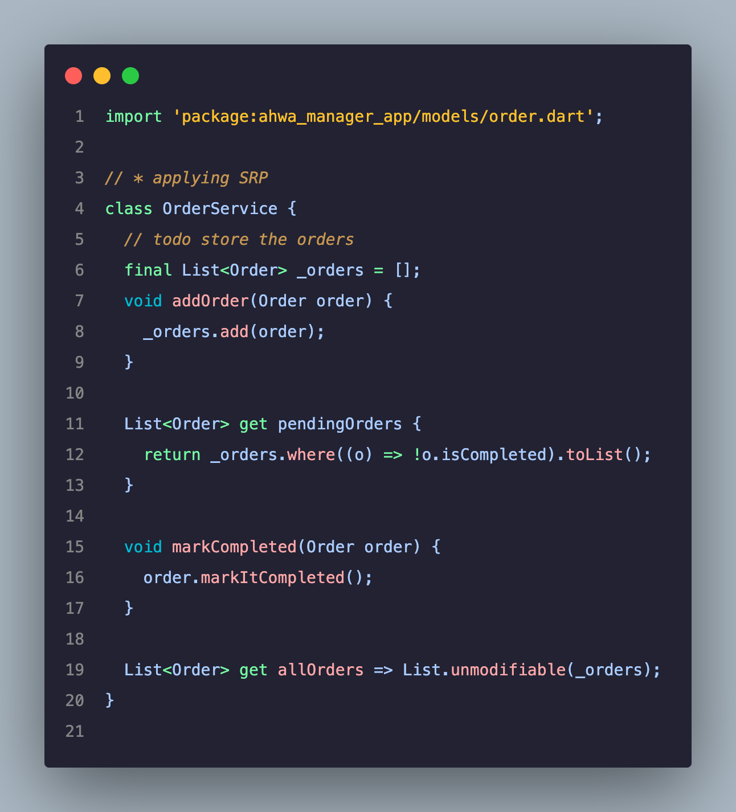
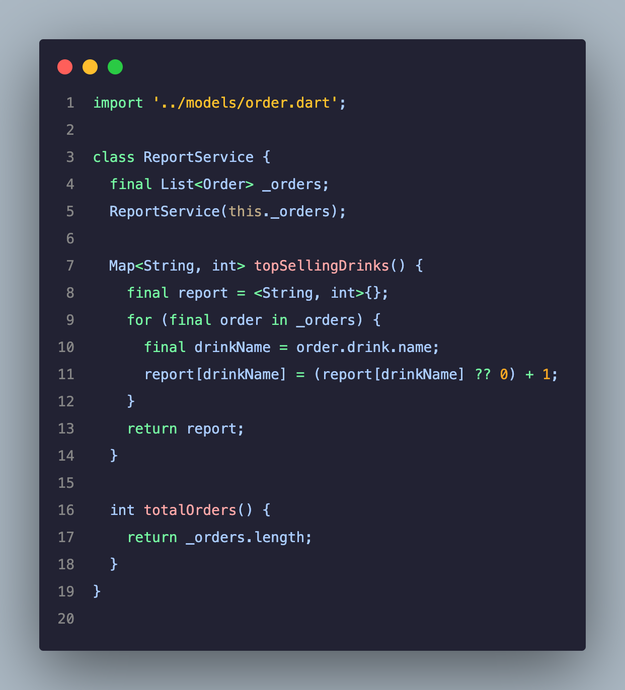

# ☕ Smart Ahwa Manager

A simple Flutter app for managing customer drink orders in a traditional Cairo *Ahwa* (coffee shop).  
This app streamlines operations: adding orders, tracking pending ones, and generating daily reports of top-selling drinks.  

---

## 📸 Screenshots

### 🏠 Home Screen  


### 📊 Daily Report  


### 📦 Core Models & Services  

**Drink Model**  


**Order Model**  


**Order Service**  


**Report Service**  


---

## 📌 Features

✅ Add new orders with:

- Customer name  
- Drink type (e.g., Coffee, Green Tea, Hibiscus Tea…)  
- Special instructions (e.g., *extra mint, ya rais*)  

✅ Mark orders as **completed**  
✅ View a **dashboard** of pending/completed orders  
✅ Generate a **daily report** with:

- Total number of orders  
- Top-selling drinks  

---

## 🏗 Code Structure

### 1. Models

- **`Drink` (abstract class)**  
  Base class for all drinks.  
  - Examples: `Coffee`, `GreenTea`, `HotChocolate`, etc.  
  - Demonstrates **Inheritance & Polymorphism** → all drinks share the same interface but have unique values.

- **`Order`**  
  Represents a single customer order.  
  - Encapsulates details like customer name, drink, and instructions.  
  - Private field `_isCompleted` with getter → demonstrates **Encapsulation**.  
  - `markItCompleted()` changes order status safely.

---

### 2. Services

- **`OrderService`**
  - Adds new orders.
  - Tracks pending orders.
  - Marks orders as completed.
  - Returns all orders safely (`List.unmodifiable`).  
  - Applies **SRP (Single Responsibility Principle)** → only manages orders.

- **`ReportService`**
  - Generates a report of top-selling drinks.
  - Counts total number of orders.  
  - Separate from `OrderService` → again **SRP**.

---

### 3. UI

- **`OrderPage`**  
  - Form for entering customer name, selecting drink, and special instructions.  
  - Button to **Add Order**.  
  - List of **Pending Orders** with "✔" button to mark complete.  
  - App bar action button → shows **Daily Report** in a dialog box.  

---

## 🔑 SOLID Principles Applied

- **S – Single Responsibility Principle (SRP):**  
  - `OrderService` only manages orders.  
  - `ReportService` only handles reporting.

- **O – Open/Closed Principle (OCP):**  
  - Adding new drinks (e.g., `TurkishCoffee`) doesn’t modify existing code, only extends it.

- **L – Liskov Substitution Principle (LSP):**  
  - Any subclass of `Drink` can replace another (Coffee, Tea, etc.) without breaking code.

- **I – Interface Segregation Principle (ISP):**  
  - Not directly applied here, but splitting models/services keeps code lean and avoids "fat interfaces."

- **D – Dependency Inversion Principle (DIP):**  
  - Services depend on abstractions (e.g., `Drink` is abstract) instead of concrete classes.

---

## 🛠 Object-Oriented Concepts Used

- **Encapsulation:**  
  - Order status `_isCompleted` is private and controlled via getter/setter methods.  

- **Inheritance:**  
  - `Drink` is extended by specific drinks like `Coffee`, `GreenTea`, `HibiscusTea`.

- **Polymorphism:**  
  - Each `Drink` subclass has different data (name/price) but is treated the same in code.

- **Abstraction:**  
  - `Drink` is abstract, forcing subclasses to define drink details.  

---

## 🚀 Getting Started

```bash
git clone https://github.com/Riyam224/smart-ahwa-manager.git
cd smart-ahwa-manager
flutter pub get
flutter run
